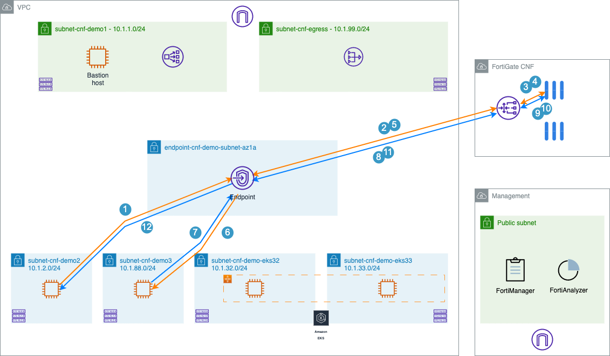
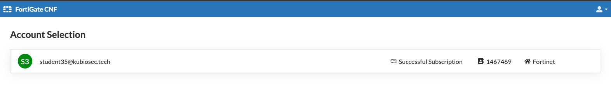
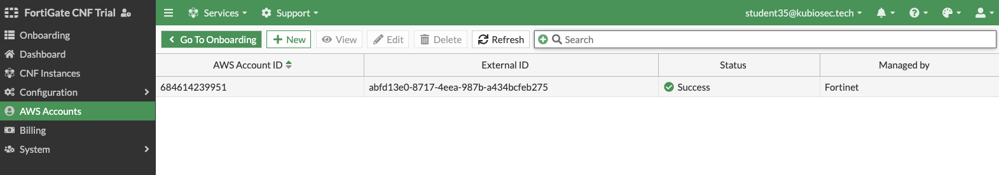
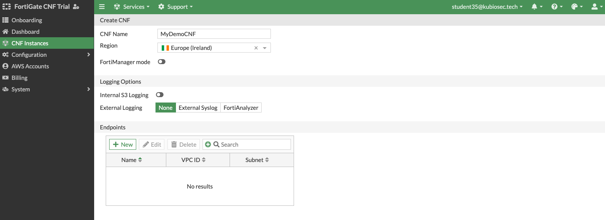
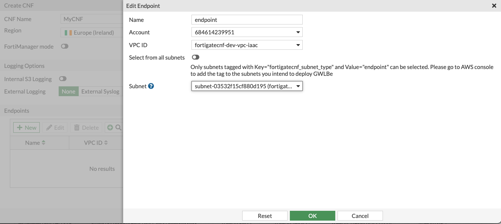
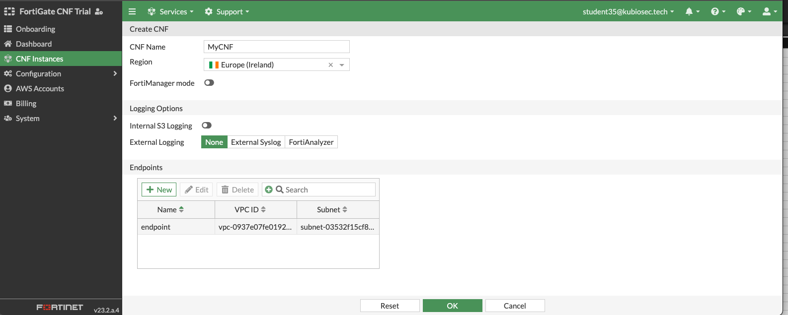
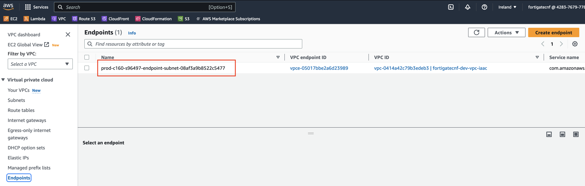

# LAB#1: Lab Setup: Intra-subnet Single VPC Use-case

## Deploy the environment
Inside the cloned repo:
```
cd ./xpert2023_aws_networking_demystified/terraform-single-vpc
```
```
terraform init
terraform apply
```
Extract the private SSH-key
```
terraform output -raw private_key >key.pem
chmod 400 key.pem
```
You can use this key to access all the other hosts in the lab, so we need to copy it to the Jumpbox.
Get the public IPv4 address of the jumpbox EC2 instance "fortigatecnf-dev-ec2-jumpbox", replace the below <jumpbox> with the public IPv4 address
```
scp -i key.pem ./key.pem ubuntu@<jumpbox>:key.pem
```
Access your Jumpbox from your Cloud9 IDE
```
ssh -i ./key.pem ubuntu@<jumpbox>
```
From your Jumpbox, you can access wwwdemo2 and wwwdemo3.
```
ssh -i key.pem ubuntu@<demo2_private_ip>
```

## Test connectivity


## Things to try
- Traffic is allowed on port 8080 and 8090 on both EC2 instances (wwwdemo2 and and wwwdemo3)
- Check the routing
- Check egress connectivity (ex. `curl https://www.fortinet.com`)

## Deploy FortigateCNF
In the next part of the LAB, we'll setup FortigateCNF to inspect traffic in between both subnets.





- In AWS marketplace, search for **Fortigate CNF** and signup for the trail. <br>
  Use the provided FortiCloud account by your instructor, (You do not need to create one).<br>
  *If your AWS account states that your trail is expired, **contact your instructor** to setup consumption based pricing*.<br>
  <br>


- Follow the instructions to add your AWS Account ID
  


- Create FortiGateCNF Instances and follow the instructions.<br>
  Use `Ireland region - eu-west-1`<br>
  




-   When completed, you can find the endpoint name in the AWS console.<br>
    Update the Terraform `variables.tf` with GWLBe name and re-run Terraform.



- Traffic should be routed through Fortigate CNF
  
## Things to try
- ex. allow traffic to port 8080 and block 8090
- Create a dynamic address group
- Chec the routing
- ...

## Cleanup for next lab
See [readme.me](../readme.md)


