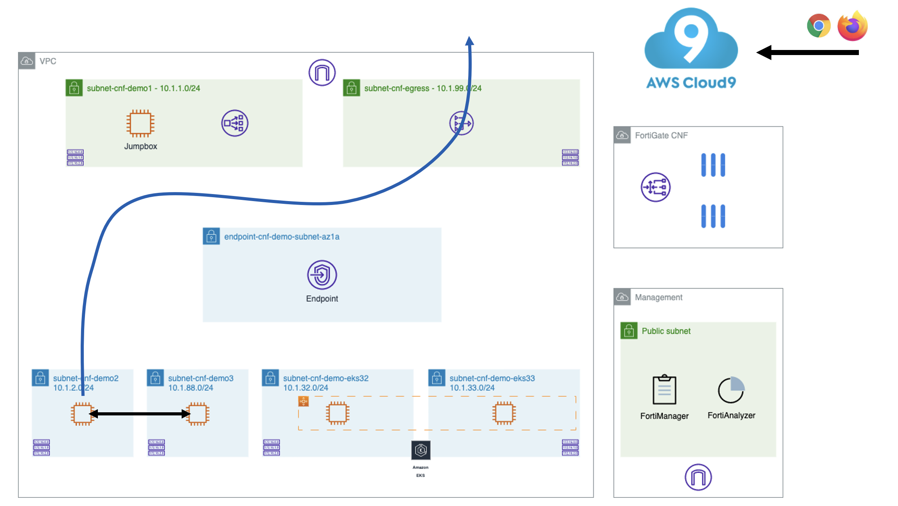

# LAB#1: Lab Setup: Intra-subnet Single VPC Use-case

## Deploy the environment
Inside the cloned repo:
```
cd ./xpert2023_aws_networking_demystified/terraform-single-vpc
```
```
terraform init
terraform apply
```
Extract the private SSH-key
```
terraform output -raw private_key >key.pem
chmod 400 key.pem
```
You can use this key to access all the other hosts in the lab, so we need to copy it to the Jumpbox.
Get the public IPv4 address of the jumpbox EC2 instance "fortigatecnf-dev-ec2-jumpbox", replace the below <jumpbox> with the public IPv4 address
```
scp -i key.pem ./key.pem ubuntu@<jumpbox>:key.pem
```
Access your Jumpbox from your Cloud9 IDE
```
ssh -i ./key.pem ubuntu@<jumpbox>
```
From your Jumpbox, you can access "fortigatecnf-dev-ec2-wwwdemo2" and "fortigatecnf-dev-ec2-wwwdemo3" EC2 instances.
```
ssh -i key.pem ubuntu@<demo2_private_ip>
```

## Test connectivity


## Things to try
- Traffic is allowed on port 8080 and 8090 on both EC2 instances (wwwdemo2 and and wwwdemo3)
- Check the routing
- Check egress connectivity (ex. `curl https://www.fortinet.com`)

## Think about possible attacks against your workload..
Now we have an environment that allows all resources to communicate with each other and to/from the internet without any security inspection or segmentation controls in place.

In the next lab, we will see how we can easily integrate FortiGate Cloud Native Firewall (FortiGate CNF) to enhance the security posture of our cloud workload.

Next step: [Lab2](https://github.com/40net-cloud/xpert2023_aws_networking_demystified/blob/xpertsummitbenelux2023/docs/lab2%20Enhance%20Security%20by%20deploying%20FortiGate%20CNF.md)
