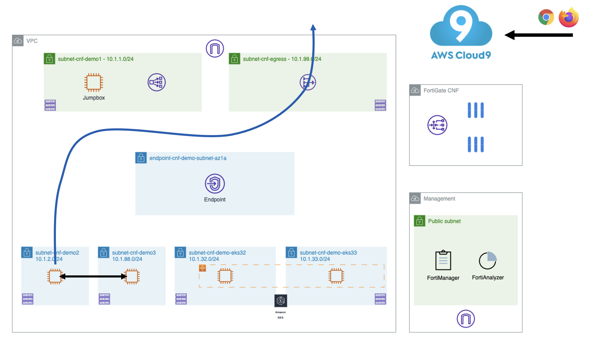
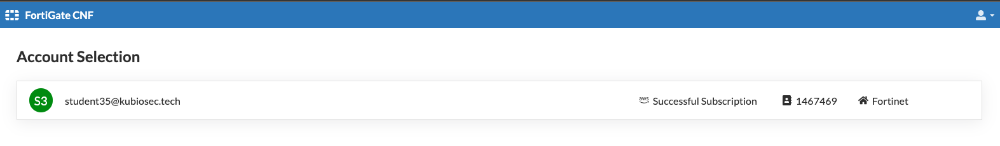
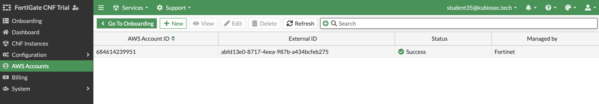

# LAB 1: intra-subnet single vpc use case

## Deploy the environment
Inside the cloned repo:
```
cd ./xpert2023_aws_networking_demystified/terraform-single-vpc
```
```
terraform init
terraform apply
```
Extract the private SSH key
```
terraform output -raw private_key >key.pem
chmod 400 key.pem
```
You can use this key to access all the other hosts in the lab, so we need to copy it to the jumpbox.
```
scp -i key.pem ./key.pem ubuntu@<jumpbox>:key.pem
```
Access your Jumpbox from your Cloud9 IDE
```
ssh -i ./key.pem ubuntu@<jumpbox>
```
From your jumpbox, you can access wwwdemo2 and wwwdemo3.
```
ssh -i key.pem ubuntu@<demo2_private_ip>
```

## Test connectivity


## Things to try
- traffic is allowed on port 8080 and 8090 on both ec2 instances (wwwdemo2 and and wwwdemo3)
- checkout the routing
- check egress connectivity (ex. `curl https://www.fortinet.com`)

## Deploy fortigatecnf
In the next part of the LAB, we'll setup FortigateCNF to inspect traffic in between both subnets.


- In AWS marketplace, search for **Fortigate CNF** and signup for the trail. <br>
  Use the provided Forticloud account by your instructor, (You do not need to create one).<br>
  *If your AWS account states that your trail is expired, **contact your instructor** to setup consumption based pricing*.<br>


- Follow the instructions to add your AWS Account ID


- Create a CNF Instances and follow the instructions.<br>
  Use `Ireland region - eu-west-1`<br>
  When completed, you can find the endpoint name in the AWS console.


- Update the TF `variables.tf` with GWLBe name and re-run TF

- Traffic should be routed through Fortigate CNF
  
## Things to try
- ex. allow traffic to port 8080 and block 8090
- create a dynamic address group
- checkout the routing
- ...

## Cleanup for next lab
See [readme.me](../readme.md)


