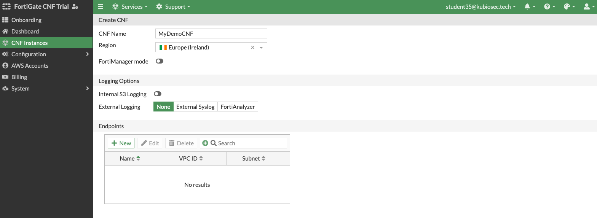
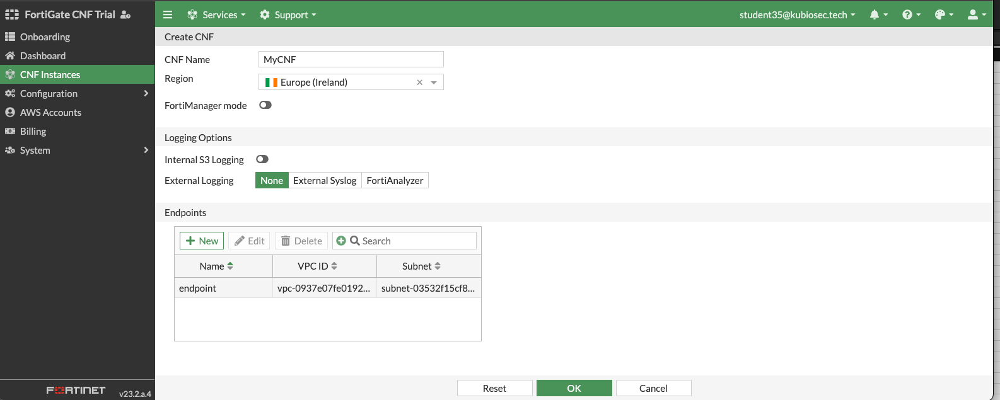

# LAB#2: Enhance Security by deploying FortiGate CNF

## Deploy FortigateCNF
In this part of the LAB, we'll setup FortigateCNF to inspect traffic in between both subnets.

- In AWS marketplace, under "Discover Products", search for **Fortigate CNF** and signup for the trail.  
  Use the provided FortiCloud account by your instructor, (You do not need to create one). 
  *If your AWS account states that your trail is expired, select the "Public" offer type to set up consumption-based pricing*. 
   

- Follow the instructions to add your AWS Account ID
  

- Create FortiGateCNF Instances and follow the instructions. 
  Use `Ireland region - eu-west-1` 
  

-   When completed, you can find the endpoint name in the AWS console. 
    Update the Terraform `variables.tf` with GWLBe name and re-run Terraform.

- Traffic should be routed through Fortigate CNF
  
## Things to try
- ex. allow traffic to port 8080 and block 8090
- Create a dynamic address group
- Chec the routing
- ...

## Cleanup
See [Home](./readme.md)

