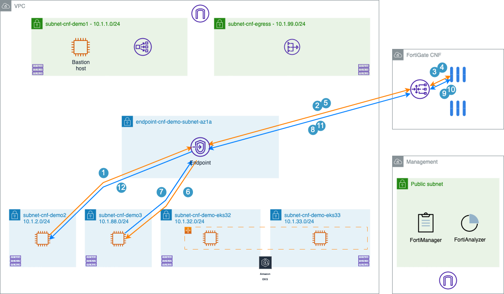
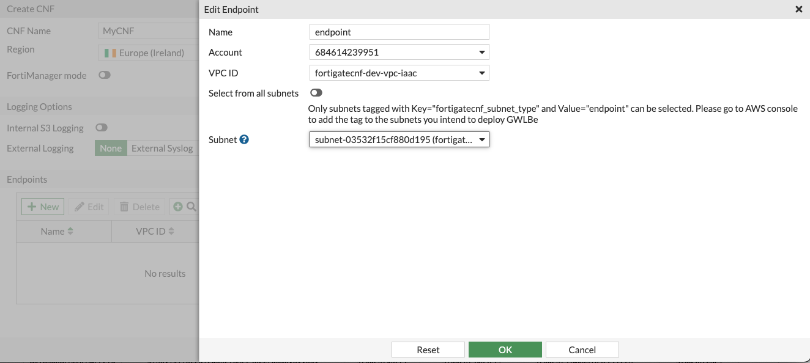
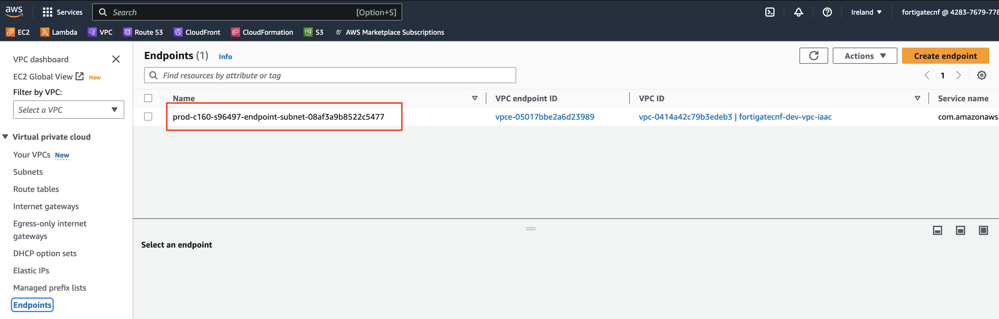

# LAB#2: Enhance Security by deploying FortiGate CNF


## Deploy FortigateCNF
In this part of the LAB, we'll setup FortigateCNF to inspect traffic in between both subnets.





- In AWS marketplace, under "Discover Products", search for **Fortigate CNF** and signup for the trail. <br>
  Use the provided FortiCloud account by your instructor, (You do not need to create one).<br>
  *If your AWS account states that your trail is expired, select the "Public" offer type to set up consumption-based pricing*.<br>
  <br>


- Click on "Subscribe", then "Set up your account" at the top of the screen, and follow the steps


- Step#2: Link a new or existing vendor account
Login to FortiCloud / FortiGate CNF
```
student<xx>@kubiosec.tech / Password (check with your instructor)
```

- Step#3 Launch FortiGate CNF CloudFormation template
  to deploy required resources for the integration between your AWS account(s) and Fortinet AWS account(s) where the FortiGate CNF is located.

- Step 4: Launch FortiGate CNF Follow the instructions to add your AWS Account ID
  


- Create FortiGateCNF Instances and follow the instructions.<br>
  Use `Ireland region - eu-west-1`<br>
  




-   When completed, you can find the endpoint name in the AWS console.<br>



- Reroute traffic to FortiGate CNF
    Two ways to do this:
      1) Manually, through updating the subnets routing table do direct the traffic to the Gateway Load Balancer endpoint.
      2) Programmatically, through Terraform. We will use this method.
            Return to the Cloud9 environment and make sure your syntax is showing the jumpbox.
            Update the Terraform `variables.tf` with GWLBe name and re-run Terraform.

- Traffic should be routed through Fortigate CNF
  
## Things to try
- ex. allow traffic to port 8080 and block 8090
- Create a dynamic address group
- Chec the routing
- ...


## Cleanup
See [Home](./readme.md)


